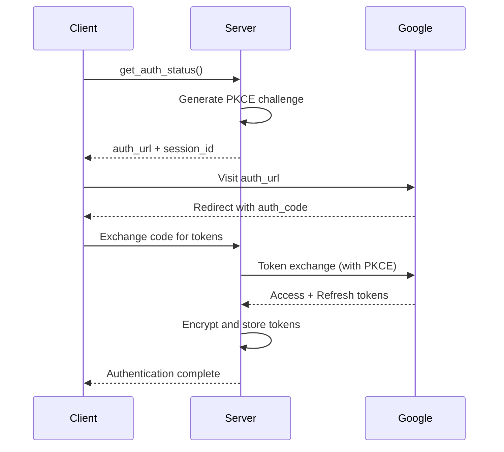

# YouTube Music MCP Server

> **Enterprise-grade YouTube Music integration for AI agents with OAuth 2.1 authentication**

An advanced Model Context Protocol (MCP) server that provides secure YouTube Music functionality to AI agents through OAuth 2.1 authentication, deployed on Smithery.ai with comprehensive security and monitoring features.

## 🎯 Features

### 🔐 Security & Authentication
- **OAuth 2.1 with PKCE** - Full compliance with RFC 7636 using S256 challenge method
- **AES-256 Encryption** - Secure token storage using Fernet encryption
- **Session Management** - Stateful session tracking with automatic cleanup
- **Rate Limiting** - Per-session limits with exponential backoff
- **Security Middleware** - Input validation, CORS, and security headers

### 🎵 YouTube Music Integration
- **Music Search** - Search songs, albums, artists, and playlists with filters
- **Playlist Management** - Create, modify, and manage user playlists
- **Library Operations** - Access user's music library and saved content
- **Error Handling** - Comprehensive error recovery and graceful degradation

### 📊 Enterprise Features
- **Health Monitoring** - Real-time health checks and status reporting
- **Metrics Collection** - Performance tracking and usage analytics
- **Structured Logging** - Contextual logging with structured output
- **Dual Storage** - Memory and Redis support for scalability

### 🚀 Deployment Ready
- **Container Support** - Docker deployment with multi-stage builds
- **Smithery.ai Integration** - Production deployment configuration
- **Environment Management** - Secure configuration through environment variables
- **Auto-scaling** - Stateless design enabling horizontal scaling

## 🏗️ Architecture

The server implements a three-layer architecture:

```
┌─────────────────────┐
│   MCP Interface     │  ← FastMCP with 7 tools
├─────────────────────┤
│  API Abstraction   │  ← YouTube Music client + rate limiting
├─────────────────────┤
│  Authentication    │  ← OAuth 2.1 + PKCE + encryption
└─────────────────────┘
```

### Core Components

- **`ytmusic_server/auth/`** - OAuth 2.1 implementation with PKCE
- **`ytmusic_server/security/`** - Encryption, validation, and middleware
- **`ytmusic_server/ytmusic/`** - YouTube Music API integration
- **`ytmusic_server/monitoring/`** - Health checks and metrics
- **`ytmusic_server/models/`** - Pydantic data models

## 🚀 Quick Start

### Prerequisites

- Python 3.11+
- Google Cloud Project with YouTube Data API v3 enabled
- OAuth 2.0 credentials (Client ID and Secret)

### Installation

1. **Clone the repository**
   ```bash
   git clone https://github.com/your-username/YTMusicPlugin.git
   cd YTMusicPlugin
   ```

2. **Install dependencies**
   ```bash
   pip install -e .
   ```

3. **Configure environment**
   ```bash
   export GOOGLE_OAUTH_CLIENT_ID="your-client-id"
   export GOOGLE_OAUTH_CLIENT_SECRET="your-client-secret"
   export ENCRYPTION_KEY="$(python -c 'from ytmusic_server.security.encryption import EncryptionManager; print(EncryptionManager.generate_key())')"
   ```

4. **Run the server**
   ```bash
   python -m ytmusic_server.server
   ```

## 🔧 MCP Tools

The server provides 7 MCP tools for YouTube Music integration:

### Authentication
- **`get_auth_status`** - Check authentication status and get OAuth URLs

### Music Discovery
- **`search_music`** - Search YouTube Music with optional filters
  ```json
  {
    "query": "Taylor Swift",
    "filter_type": "songs",
    "limit": 20
  }
  ```

### Playlist Management
- **`get_playlists`** - Get user's playlists
- **`create_playlist`** - Create new playlists with privacy controls
- **`get_playlist_details`** - Get detailed playlist information with tracks
- **`add_songs_to_playlist`** - Add songs to existing playlists

### System Monitoring
- **`get_server_status`** - Get server health and performance metrics

## 🔐 OAuth 2.1 Flow

The server implements the complete OAuth 2.1 authorization code flow with PKCE:



## 🐳 Docker Deployment

```dockerfile
# Build and run with Docker
docker build -t ytmusic-mcp .
docker run -p 8080:8080 \
  -e GOOGLE_OAUTH_CLIENT_ID="your-client-id" \
  -e GOOGLE_OAUTH_CLIENT_SECRET="your-client-secret" \
  -e ENCRYPTION_KEY="your-encryption-key" \
  ytmusic-mcp
```

## 🌍 Smithery.ai Deployment

Deploy to Smithery.ai with automatic OAuth configuration:

```bash
# Install Smithery CLI
npm install -g @smithery/cli

# Deploy to Smithery.ai
smithery deploy
```

The `smithery.yaml` configuration includes:
- OAuth client registration
- Environment variable schema
- Container runtime specification
- Health check endpoints

## ⚙️ Configuration

### Environment Variables

| Variable | Description | Required | Default |
|----------|-------------|----------|---------|
| `GOOGLE_OAUTH_CLIENT_ID` | Google OAuth 2.0 Client ID | Yes | - |
| `GOOGLE_OAUTH_CLIENT_SECRET` | Google OAuth 2.0 Client Secret | Yes | - |
| `ENCRYPTION_KEY` | Base64 encryption key (32 bytes) | Yes | Auto-generated |
| `REDIS_URL` | Redis connection URL for storage | No | Memory storage |
| `RATE_LIMIT_PER_MINUTE` | Rate limit per user per minute | No | `60` |

### Google Cloud Setup

1. **Create a Google Cloud Project**
2. **Enable YouTube Data API v3**
3. **Create OAuth 2.0 credentials**
   - Application type: Web application
   - Authorized redirect URIs: `http://localhost:8080/auth/callback`
4. **Download client credentials**

## 📊 Monitoring

### Health Endpoints

- **`/health`** - Basic health check
- **`/health/detailed`** - Comprehensive health status
- **`/metrics`** - Performance metrics (Prometheus format)

### Structured Logging

All components use structured logging with contextual information:

```json
{
  "timestamp": "2024-01-15T10:30:00Z",
  "level": "info",
  "component": "oauth_manager",
  "message": "Token refreshed successfully",
  "session_id": "abc123...",
  "duration_ms": 245
}
```

## 🔒 Security

### Token Security
- **Encryption**: All tokens encrypted with AES-256
- **Storage**: Secure storage with automatic cleanup
- **Refresh**: Automatic token refresh with retry logic
- **Expiration**: Configurable session timeouts

### Request Security
- **Rate Limiting**: Per-session and global limits
- **Input Validation**: Comprehensive input sanitization
- **CORS**: Configurable cross-origin policies
- **Headers**: Security headers (HSTS, CSP, etc.)

### Audit & Compliance
- **Logging**: All authentication events logged
- **Monitoring**: Real-time security event detection
- **Standards**: OWASP compliance and OAuth 2.1 standards

## 📚 API Reference

### Search Music
```python
# Search for songs
result = await search_music(
    query="Bohemian Rhapsody",
    filter_type="songs",
    limit=10
)
```

### Create Playlist
```python
# Create a new playlist
playlist = await create_playlist(
    name="My Favorites",
    description="Best songs ever",
    privacy_status="PRIVATE"
)
```

### Add Songs
```python
# Add songs to playlist
result = await add_songs_to_playlist(
    playlist_id="PLrAWu...",
    video_ids=["dQw4w9WgXcQ", "kJQP7kiw5Fk"]
)
```

## 🧪 Testing

```bash
# Install test dependencies
pip install -e ".[test]"

# Run tests
pytest tests/

# Run with coverage
pytest --cov=ytmusic_server tests/
```

## 🤝 Contributing

1. Fork the repository
2. Create a feature branch: `git checkout -b feature/amazing-feature`
3. Commit changes: `git commit -m 'Add amazing feature'`
4. Push to branch: `git push origin feature/amazing-feature`
5. Open a Pull Request

### Development Setup

```bash
# Clone and setup development environment
git clone https://github.com/your-username/YTMusicPlugin.git
cd YTMusicPlugin

# Create virtual environment
python -m venv venv
source venv/bin/activate  # On Windows: venv\Scripts\activate

# Install in development mode
pip install -e ".[dev]"

# Run pre-commit hooks
pre-commit install
```

## 📝 License

This project is licensed under the MIT License - see the [LICENSE](LICENSE) file for details.

## 🙏 Acknowledgments

- **[ytmusicapi](https://github.com/sigma67/ytmusicapi)** - The excellent unofficial YouTube Music API
- **[Smithery.ai](https://smithery.ai)** - MCP server hosting platform
- **[FastMCP](https://github.com/pschmidtu/fastmcp)** - Fast MCP server framework

## 📞 Support

- **Issues**: [GitHub Issues](https://github.com/your-username/YTMusicPlugin/issues)
- **Discussions**: [GitHub Discussions](https://github.com/your-username/YTMusicPlugin/discussions)
- **Documentation**: [Wiki](https://github.com/your-username/YTMusicPlugin/wiki)

---

**Built with ❤️ for the AI agent ecosystem**