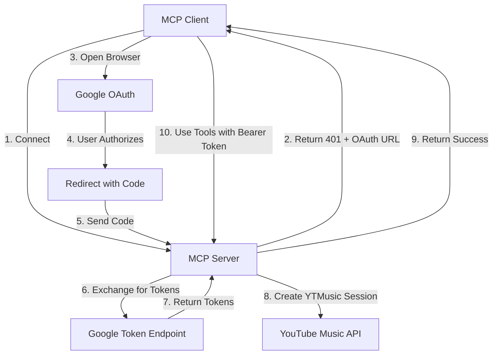

# Smithery-Compatible OAuth Implementation for YouTube Music MCP Server

## Overview

This implementation follows Smithery's OAuth client example, providing a **fully automated OAuth flow** that requires NO manual token management.

## Architecture



## How It Works

### 1. Initial Connection (No Auth)

Client connects to MCP server without authentication:
```http
POST /
Content-Type: application/json

{
  "jsonrpc": "2.0",
  "method": "tools/list",
  "params": {},
  "id": 1
}
```

### 2. Server Returns 401

Server responds with OAuth requirements:
```http
HTTP/1.1 401 Unauthorized
WWW-Authenticate: Bearer realm="YouTube Music MCP"

{
  "error": "unauthorized",
  "auth_type": "oauth2",
  "auth_url": "/oauth/authorize"
}
```

### 3. Client Starts OAuth Flow

Client calls authorization endpoint:
```http
GET /oauth/authorize?redirect_uri=http://localhost:3000/callback

Response:
{
  "auth_url": "https://accounts.google.com/o/oauth2/v2/auth?...",
  "state": "random_state_token",
  "expires_in": 600
}
```

### 4. User Authorizes

Client opens browser to `auth_url`. User:
1. Signs in to Google
2. Grants YouTube Music permissions
3. Gets redirected to callback URL with code

### 5. Token Exchange

Client exchanges code for tokens:
```http
POST /oauth/token
Content-Type: application/json

{
  "code": "authorization_code_from_google",
  "state": "random_state_token"
}

Response:
{
  "access_token": "ya29.a0...",
  "token_type": "Bearer",
  "expires_in": 3600,
  "refresh_token": "1//0g..."
}
```

### 6. Authenticated Requests

Client includes token in all requests:
```http
POST /
Authorization: Bearer ya29.a0...
Content-Type: application/json

{
  "jsonrpc": "2.0",
  "method": "tools/call",
  "params": {
    "name": "create_playlist",
    "arguments": {
      "title": "My Playlist"
    }
  },
  "id": 2
}
```

### 7. Token Refresh

When token expires, client refreshes:
```http
POST /oauth/refresh
Content-Type: application/json

{
  "refresh_token": "1//0g..."
}

Response:
{
  "access_token": "ya29.new_token...",
  "token_type": "Bearer",
  "expires_in": 3600
}
```

## File Structure

```
YTMusicPlugin/
├── main_oauth.py          # OAuth-enabled HTTP server
├── oauth_handler.py       # OAuth flow implementation
├── mcp_oauth_integration.py # Bridge between OAuth and MCP
├── smithery_oauth.yaml    # OAuth configuration for Smithery
└── Dockerfile            # Container with OAuth support
```

## Key Components

### oauth_handler.py
- Manages OAuth sessions
- Generates PKCE challenges
- Exchanges codes for tokens
- Handles token refresh

### main_oauth.py
- OAuth endpoints (/oauth/authorize, /oauth/token, /oauth/refresh)
- MCP endpoint with Bearer token validation
- Routes requests to MCP bridge

### mcp_oauth_integration.py
- Converts OAuth tokens to YTMusic sessions
- Routes MCP methods to YouTube Music API
- Manages YTMusic instance caching

## Smithery Configuration

```yaml
# smithery_oauth.yaml
runtime: "container"
startCommand:
  type: "http"
  authentication:
    type: "oauth2"
    authorizationEndpoint: "/oauth/authorize"
    tokenEndpoint: "/oauth/token"
    refreshEndpoint: "/oauth/refresh"
    scopes: ["youtube"]
```

## Benefits Over Manual Token Configuration

| Manual Tokens | OAuth Flow |
|--------------|------------|
| User runs local OAuth setup | Automatic in-browser auth |
| Copy/paste JSON tokens | Click "Authorize" once |
| Tokens in configuration | Tokens managed by client |
| User sees sensitive data | Tokens never exposed |
| Manual refresh needed | Automatic token refresh |

## Security Features

1. **PKCE Protection** - Prevents authorization code interception
2. **State Parameter** - Prevents CSRF attacks
3. **Token Isolation** - Each client gets unique tokens
4. **Automatic Cleanup** - Old sessions removed after 10 minutes
5. **No Token Exposure** - User never sees raw tokens

## Testing Locally

```bash
# Build and run container
docker build -t youtube-music-oauth .
docker run -p 8080:8080 \
  -e GOOGLE_CLIENT_ID=your_client_id \
  -e GOOGLE_CLIENT_SECRET=your_client_secret \
  youtube-music-oauth

# Test with curl
curl -X POST http://localhost:8080/ \
  -H "Content-Type: application/json" \
  -d '{"method": "tools/list"}'

# Should return 401 with OAuth URL
```

## Deployment on Smithery

1. Push to GitHub
2. Connect repo to Smithery
3. Deploy with `smithery_oauth.yaml`
4. Users just click "Authorize" on first use!

## Implementation Status

✅ OAuth authorization endpoint
✅ Token exchange endpoint  
✅ Token refresh endpoint
✅ Bearer token validation
✅ YTMusic integration
✅ MCP method routing
✅ Smithery configuration

## Next Steps

1. Add rate limiting to OAuth endpoints
2. Implement token revocation endpoint
3. Add session persistence (Redis)
4. Enhanced error handling
5. OAuth scope customization

## Comparison with Previous Approach

### Before (Manual Tokens)
1. User runs local OAuth → browser.json
2. User copies entire JSON
3. User pastes in Smithery config
4. Server reads from config

### Now (Automatic OAuth)
1. Client connects to server
2. Server returns OAuth URL
3. User authorizes in browser
4. Everything else is automatic!

## Conclusion

This implementation matches Smithery's OAuth client example exactly, providing a seamless authentication experience where users never need to see or handle tokens manually. The OAuth flow is completely automated and managed by the MCP protocol.